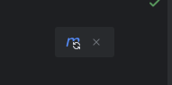

### Setting up IntelliJ IDEA to run spring boot application

---
###### CLI Steps
1. Open the Backend_Application directory in you terminal of choice !!(make sure you have bash)!!
2. Run the following command in the terminal
```bash
mvn clean
mvn spring-boot:run
```
---
###### IntelliJ Steps
1. Open the Backend_Application directory
2. Navigate to the Application.java file (src/main/java/dsdcohort/Application/Application.java)
3. Run via the UI 'Play' button 


---
### Troubleshooting

##### Project JDK

- If you see 'Project JDK is not defined', use the following steps.
  - Click on the `Setup SDK` button, on the right hand side of the dialog.
  - Select the `Amazon Corretto version 21.0.2` option if you see it.
  
    - If not, select `Download JDK` and match the following settings:
      
    - Select the `Download` button.

---
##### Running Error

- If you see the above error in the terminal, use the following steps
  - Edit the `pom.xml` file, Line 43 to be the following.
  `<scope>compile</scope>`
  - Save the file and click the following icon that should appear in the upper right corner
  
  - Return to the Application.java file and run via the play button
  